<small markdown>
[Document Decisions in a Software Project](../document-decisions/) ⇒
</small>

# :white_check_mark: Use **Architecture Decision Record** _(ADR)_ format

## Context

### Alternative formats

{{ render("decision-document-formats") }}

### ADR vs RFC

{{ render("documenting-design-decisions-using-adrs-and-rfcs") }} blog post by {{ render("bruno-schleufer") }} compares the two techniques. The most important difference between the two is the relation between documentation, on the one hand, and the discussion about the decision within the team responsible for the project.

```mermaid
graph LR
    rfc("✍️ Write an RFC") --> discuss["💬 Discuss"] --> adr("✍️ Write an ADR")
```

* **RFC** is a seed for discussion, a draft around which the team discusses the problem. Its main purpose is to facilitate and organize that discussion;
* whereas **ADR** is written to put to paper a decision that has been already made in such a way to ensure that
  * all possibilities were considered,
  * and the decision is optimal based on current knowledge.

My thought would be that preference among RFC and ADR depends on the size of the team involved in decision-making.

{{ render("rfc-vs-adr") }}

## Decision

Small teams are a best practice anyway. {{ render("use-adr") }} seems to be the optimal choice for them.

## Consequences

{{ render("adr-pro-et-contra") }}
